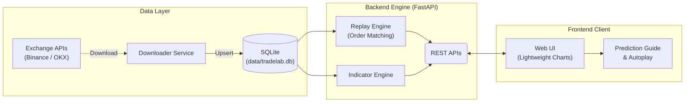

<div align="center">

# 📈 TradeLab

**面向专业交易者的离线历史行情回放与复盘训练平台**

[](https://www.python.org/)
[](https://fastapi.tiangolo.com/)
[](https://www.tradingview.com/lightweight-charts/)
[](#-历史数据下载)
[](#-核心特性)
[](LICENSE)

*告别“后视镜”偏差，用真实随机历史切片打磨交易系统*

[**更新亮点**](#-本次重大更新) · [**快速开始**](#-快速开始) · [**API 一览**](#-api-一览) · [**FAQ**](#-faq)

</div>

---

## 💡 为什么选择 TradeLab？

在传统复盘中，你常会无意识看到右侧“未来价格”，形成**后视镜偏差（Hindsight Bias）**。  
TradeLab 的核心理念是：

- 从历史区间中随机抽取切片
- 仅展示左侧可见 K 线
- 你先给出交易计划，再播放后续行情验证

这让复盘更接近实盘的决策环境。

---

## 🚀 本次重大更新

- **一键回放流程重构**：点击 `Replay` 后自动执行 `创建会话 -> 提交预测 -> 自动播放`，减少手动步骤。
- **隐藏区间智能化**：`hidden_bars` 改为可选。默认自动取“可见区间之后的全部剩余 K 线”，更贴近真实盲测。
- **图表交互下单**：支持在主图直接拖拽 `ENTRY/SL/TP` 价格线，实时联动 RR、PNL、ROI 预估。
- **预测模式升级**：多空选择改为下拉模式（Long/Short），并自动生成默认 1:1 风险收益参数。
- **可视化增强**：预测阶段新增右侧未来空间与盈亏引导区；成交后显示仓位区间、实时/最终收益与状态。
- **并发与稳定性优化**：会话/指标刷新引入版本令牌，避免异步竞态导致的错位渲染。

---

## ✨ 核心特性

- **🎲 随机盲测切片**：按 `交易对 + 周期 + 日期范围` 随机起点抽题，严格隐藏未来。
- **⚙️ 自动隐藏长度**：默认 `visible_bars` 之后全部为隐藏区；也可通过 API 显式设置 `hidden_bars`。
- **🧭 图表化预测工具**：支持多/空、限价入场、杠杆、止盈止损，同图拖拽微调。
- **⚔️ 真实交易结算**：限价触发、同 K 冲突优先级、杠杆爆仓、数据结束强平。
- **📈 专业图表体验**：主图 + 副图（指标面板）联动，十字光标同步，平滑缩放滚动。
- **🛠️ 指标系统**：内置 `SMA / EMA / BOLL / RSI / MACD`，支持参数与颜色配置并本地持久化。
- **🌍 国际化支持**：中英文界面无缝切换。

---

## 🏗️ 架构设计



---

## 📁 项目结构

```text
TradeLab/
├─ backend/
│  └─ app/
│     ├─ main.py                     # FastAPI 入口与路由
│     ├─ db.py                       # SQLite 初始化/迁移/Upsert
│     ├─ services/
│     │  ├─ exchange_downloader.py   # Binance/OKX 历史数据下载
│     │  ├─ replay.py                # 回放撮合与交易评估
│     │  ├─ indicators.py            # 指标计算
│     │  ├─ repository.py            # 数据访问层
│     │  └─ bootstrap.py             # 示例数据生成逻辑
│     ├─ scripts/
│     │  ├─ download_history.py      # 历史数据下载 CLI
│     │  ├─ import_csv.py            # CSV 导入工具
│     │  └─ generate_sample_data.py  # 示例数据脚本
│     └─ static/
│        ├─ index.html               # 前端页面
│        ├─ styles.css               # 样式
│        └─ app.js                   # 前端交互与图表逻辑
├─ data/
│  └─ tradelab.db                    # SQLite 数据库
├─ requirements.txt
└─ README.md
```

---

## 🚀 快速开始

### 1. 环境准备

要求：**Python 3.11+**

```bash
conda create -y -n TradeLab python=3.11
conda activate TradeLab
pip install -r requirements.txt
```

### 2. 下载历史数据（示例）

```bash
python backend/app/scripts/download_history.py \
  --exchange binance \
  --pair BTC/USDT:USDT \
  --market-type auto \
  --timeframe 1h \
  --start 2025-01-01T00:00:00Z \
  --end 2025-03-01T00:00:00Z
```

### 3. 启动服务

```bash
uvicorn app.main:app --app-dir backend --reload --port 8000
```

打开浏览器访问：**http://127.0.0.1:8000**

### 4. 回放操作（新版）

1. 选择 `Pair / Timeframe / Date Range / Visible`
2. 点击刷新图标（随机抽新题）
3. 在右侧设置多空与参数，或直接在图上拖拽 `ENTRY/SL/TP`
4. 点击 `Replay` 一键开始（自动提交预测并播放）
5. 点击 `Pause` 暂停

---

## 📦 历史数据下载

### 支持周期

`5m` | `15m` | `30m` | `1h` | `2h` | `4h` | `6h` | `8h` | `12h` | `1d` | `3d` | `1w` | `1M`

### Pair 格式

推荐使用规范格式（大小写不敏感，系统会归一化为大写）：

- **现货**：`BASE/QUOTE`（例如 `BTC/USDT`）
- **永续（线性）**：`BASE/QUOTE:USDT`（例如 `BTC/USDT:USDT`）
- **永续（反向）**：`BASE/USD:BASE`（例如 `BTC/USD:BTC`）
- **OKX 交割合约**：`BTC-USDT-240628`（并指定 `--market-type futures`）

下载后写入数据库时会保存为标准化 `stored_pair`（如 `BINANCE:BTC/USDT:USDT`）。

---

## ⚔️ 回放与撮合规则

1. **限价入场**：预测提交后不会立即成交，需后续 K 线触及 `entry_price_limit`。
2. **同 K 双触发处理**：`sl_tp_priority` 可选：`stop_first` 或 `take_first`。
3. **杠杆爆仓**：价格触及清算价直接判定 `liquidation`，`ROI = -100%`。
4. **未成交挂单**：到数据终点仍未成交则标记 `entry_not_filled`。
5. **持仓到期强平**：到数据终点仍未触发止盈止损，按最后一根 `close` 平仓（`end_of_data`）。

---

## 🔌 API 一览

| 分类 | 方法 | 路径 | 描述 |
| :--- | :--- | :--- | :--- |
| System | GET | `/api/health` | 健康检查与数据量 |
| Market | GET | `/api/market/pairs` | 列出可用交易对 |
| Market | GET | `/api/market/timeframes` | 列出周期（可按 pair 过滤） |
| Market | GET | `/api/market/range` | 查询 pair/timeframe 的时间范围 |
| Data | POST | `/api/data/download` | 同步下载并写入历史数据 |
| Replay | POST | `/api/replay/sessions` | 创建随机回放会话 |
| Replay | GET | `/api/replay/sessions/{id}` | 查询会话快照 |
| Replay | POST | `/api/replay/sessions/{id}/prediction` | 提交预测 |
| Replay | POST | `/api/replay/sessions/{id}/step` | 推进回放 |
| Indicators | GET | `/api/indicators/catalog` | 查询指标目录 |
| Indicators | GET | `/api/replay/sessions/{id}/indicator` | 计算当前会话指标 |

### 会话创建关键参数

- `pair`: 默认 `BINANCE:BTC/USDT`
- `timeframe`: 默认 `4h`
- `visible_bars`: 20~500
- `hidden_bars`: 可选；不传则自动使用剩余全部 bars
- `seed`: 可选，固定随机种子

### 预测提交关键参数

- `side`: `long` / `short`
- `entry_price_limit`: 限价入场价
- `margin_usdt`: 保证金（>0）
- `leverage`: 3~100
- `sl_tp_priority`: `stop_first` / `take_first`
- 止盈止损可二选一：
  - 价格模式：`stop_loss_price + take_profit_price`
  - 百分比模式：`stop_loss_pct + take_profit_pct`

---

## ❓ FAQ

**Q1: 页面提示 No Data？**  
A: 先运行 `download_history.py` 下载至少一个交易对+周期的数据，再刷新页面。

**Q2: 重复下载同一区间会产生重复脏数据吗？**  
A: 不会。`candles` 表主键为 `(pair, timeframe, open_time)`，写入采用 Upsert。

**Q3: 可以不下载真实数据直接体验吗？**  
A: 可以。

```bash
ENABLE_SAMPLE_DATA=1 uvicorn app.main:app --app-dir backend --reload --port 8000
```

或手动生成：

```bash
python backend/app/scripts/generate_sample_data.py
```

---

## 🛣️ Roadmap

- [ ] 支持更多交易所与品种
- [ ] 增加多策略复盘批任务
- [ ] 提供复盘结果导出与统计面板
