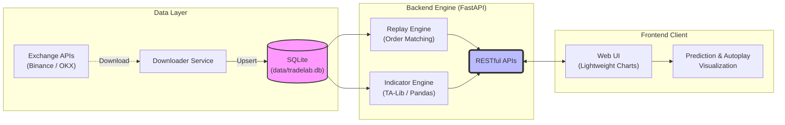

<div align="center">

# 📈 TradeLab

**面向专业交易者的离线历史行情回放与复盘训练平台**

[](https://www.python.org/)
[](https://fastapi.tiangolo.com/)
[](https://www.tradingview.com/lightweight-charts/)
[](#-历史数据下载)
[](#-核心特性)
[](LICENSE)

*告别“后视镜”偏差，用真实的随机历史切片打磨你的交易系统*

[**功能特性**](#-核心特性) · [**快速开始**](#-快速开始) · [**API文档**](#-api-一览) · [**常见问题**](#-faq)

</div>

---

## 💡 为什么选择 TradeLab？

在传统的看盘软件上复盘时，交易者往往会无意识地看到“右侧未来”的价格走势，从而产生**“后视镜偏差”**（Hindsight Bias），导致在模拟复盘中百战百胜，但在实盘中却屡战屡败。

**TradeLab** 的核心理念是**“不知道答案的考试”**：
从你指定的长周期历史数据中**随机切割**出一个时间段并隐藏未来走势。你需要基于当前的 K 线形态与指标，严格制定交易计划（入场、止损、止盈、杠杆）。随着行情一根根 K 线地向右推演，系统将自动判定你的盈亏并记录复盘表现。

---

## ✨ 核心特性

- **🎲 随机盲测切片**：选择 `交易对 + 时间周期 + 日期范围`，系统随机抽取切片起点并隐藏未来行情，彻底杜绝“背答案”。
- **📊 真实历史数据驱动**：原生支持 `Binance` 和 `OKX`，可一键下载现货、USDT永续、COIN永续及交割合约数据。
- **⚔️ 完整的订单回测系统**：支持模拟真实的做多/做空（Long/Short）、限价单（Limit Entry）、止盈止损（SL/TP）、3x~100x 杠杆，精准计算仓位名义价值与维持保证金。
- **📈 专业级图表体验**：基于 `TradingView Lightweight Charts` 打造。主副图联动、十字星悬浮同步、流畅拖拽缩放。
- **🛠️ 丰富的技术指标库**：内置 `SMA`, `EMA`, `BOLL`, `RSI`, `MACD` 等常用指标。支持参数和样式的深度定制，刷新不丢失。严格防范未来函数，所有指标均基于“当前已揭示K线”计算。
- **🎨 数据可视化**：盈亏背景直观变色（红/绿），实时结算 `PNL`、`ROI` 与盈亏比（R-Multiple），真实模拟爆仓逻辑。
- **🌍 国际化支持**：原生内置中英文（ZH/EN）无缝切换，语言配置自动持久化。

---

## 🏗️ 架构设计

TradeLab 采用前后端分离的现代化架构，确保回测引擎的严谨性与前端渲染的流畅性。



---

## 📁 项目结构

```text
TradeLab/
├─ backend/
│  └─ app/
│     ├─ main.py                     # FastAPI 应用入口与路由
│     ├─ db.py                       # SQLite 初始化/表迁移/Upsert
│     ├─ services/                   # 核心业务逻辑
│     │  ├─ exchange_downloader.py   # 交易所历史数据下载器
│     │  ├─ replay.py                # 撮合引擎与交易结算
│     │  ├─ indicators.py            # 技术指标计算引擎
│     │  └─ repository.py            # 数据读写 DAO 层
│     ├─ scripts/                    # 运维与数据工具
│     │  ├─ download_history.py      # 历史数据下载 CLI
│     │  ├─ import_csv.py            # 本地 CSV 数据导入
│     │  └─ generate_sample_data.py  # 示例数据生成工具
│     └─ static/                     # 前端静态资源 (可独立部署)
│        ├─ index.html               # UI 骨架
│        ├─ styles.css               # 样式表
│        └─ app.js                   # 图表渲染与核心交互逻辑
├─ data/
│  └─ tradelab.db                    # 默认 SQLite 数据库文件
├─ requirements.txt                  # Python 依赖清单
└─ README.md                         # 项目说明文档
```

---

## 🚀 快速开始

### 1. 环境准备

推荐使用 Conda 或 Venv 管理 Python 虚拟环境（要求 **Python 3.11+**）：

```bash
conda create -y -n TradeLab python=3.11
conda activate TradeLab
git clone https://github.com/yourusername/TradeLab.git  # 替换为实际仓库地址
cd TradeLab
pip install -r requirements.txt
```

### 2. 下载历史数据

平台需要历史数据作为“题库”。以下命令将下载 Binance 上 `BTC/USDT` 的永续合约 1 小时 K 线数据：

```bash
python backend/app/scripts/download_history.py \
  --exchange binance \
  --pair BTC/USDT:USDT \
  --timeframe 1h \
  --start 2024-01-01T00:00:00Z \
  --end 2024-12-31T23:59:59Z
```

### 3. 一键启动服务

```bash
uvicorn app.main:app --app-dir backend --reload --port 8000
```

> 服务启动后，打开浏览器访问 **[http://127.0.0.1:8000](http://127.0.0.1:8000)** 即可开始你的交易训练。

---

## 📦 数据获取与规范

### 支持的时间周期 (Timeframes)

`5m` | `15m` | `30m` | `1h` | `2h` | `4h` | `6h` | `8h` | `12h` | `1d` | `3d` | `1w` | `1M`

### 交易对命名规范 (Pair Convention)

TradeLab 使用极其严谨的 `交易所:Base/Quote:Settle` 格式，彻底消除歧义：

| 市场类型 | 命名格式 | 示例 |
| :--- | :--- | :--- |
| **现货 (Spot)** | `EXCHANGE:BASE/QUOTE` | `BINANCE:BTC/USDT` |
| **USDT 永续** | `EXCHANGE:BASE/QUOTE:USDT` | `BINANCE:BTC/USDT:USDT` |
| **币本位 永续** | `EXCHANGE:BASE/USD:BASE` | `BINANCE:BTC/USD:BTC` |
| **交割合约** | `OKX:FUTURES:<instId>` | `OKX:FUTURES:BTC-USDT-240628` |

*(注：在命令行工具中输入时，可省略交易所前缀，系统将自动纠正并补齐。)*

<details>
<summary><b>点击展开：按市场下载数据的具体命令示例</b></summary>

**Binance 现货**
```bash
python backend/app/scripts/download_history.py \
  --exchange binance --pair BTC/USDT --timeframe 1h --start 2024-01-01T00:00:00Z --end 2025-01-01T00:00:00Z
```

**OKX USDT 永续**
```bash
python backend/app/scripts/download_history.py \
  --exchange okx --pair BTC/USDT:USDT --timeframe 1h --start 2024-01-01T00:00:00Z --end 2025-01-01T00:00:00Z
```

**自建 CSV 数据导入**
字段名需包含：`open_time` (Unix 秒戳), `open`, `high`, `low`, `close`, `volume`
```bash
python backend/app/scripts/import_csv.py \
  --csv /path/to/data.csv --pair BINANCE:BTC/USDT --timeframe 1h
```

</details>

> **国内网络受限？**
> 可通过环境变量配置自定义 API 代理域名：
> ```bash
> export BINANCE_API_BASE=https://api.binance.com
> export BINANCE_FAPI_BASE=https://fapi.binance.com
> export BINANCE_DAPI_BASE=https://dapi.binance.com
> export OKX_API_BASE=https://www.okx.com
> ```

---

## ⚔️ 回放与撮合规则

为了最大程度逼近真实的交易体验，回放引擎内置了以下硬核规则：

1. **限价触发**：提交计划后不会立刻按当前最后收盘价成交，而是等待后续 K 线的最高/最低价触及设置的 `Entry Price` 才算真正入场。
2. **同 K 线双踩冲突判断**：如果未来某一根振幅巨大的 K 线同时触及了您的 `Take Profit` 和 `Stop Loss`，可通过预设的 `sl_tp_priority` 设置悲观逻辑（`stop_first` 止损优先）或乐观逻辑（`take_first` 止盈优先）。
3. **真实杠杆爆仓**：当价格反向波动导致未实现亏损超过账户可用名义维持保证金时，直接判定爆仓，ROI 强制记为 `-100%`。
4. **强制平仓**：如果历史行情播放到设定的数据终点时，您的挂单仍未触发，或者持仓仍未达到止盈止损条件，系统将以最后一根 K 线的 `close` 价格进行强制市价平仓（`end_of_data`）。

---

## 🔌 API 接口全景图

系统提供了一套基于 RESTful 标准的 OpenAPI，不局限于前端调用，您也可以使用代码对接自己的量化回测脚本。

| 分类 | 接口路径 | 描述 |
| :--- | :--- | :--- |
| **System** | `GET /api/health` | 服务健康检查 |
| **Market** | `GET /api/market/pairs` | 获取数据库中已有的全量交易对 |
| **Market** | `GET /api/market/timeframes` | 查询特定交易对支持的时间周期 |
| **Market** | `GET /api/market/range` | 查询特定交易对的时间起止范围 |
| **Data** | `POST /api/data/download` | 后台异步下载历史数据任务 |
| **Replay** | `POST /api/replay/sessions` | 构建一个新的随机回放隔离沙箱 |
| **Replay** | `GET /api/replay/sessions/{id}` | 获取沙箱详细状态与持仓信息 |
| **Replay** | `POST /api/replay/sessions/{id}/prediction` | 提交交易计划（订单模拟） |
| **Replay** | `POST /api/replay/sessions/{id}/step` | 向前推进 1 根或多根 K 线 |
| **Indicators** | `GET /api/indicators/catalog` | 查询系统支持的所有指标种类 |
| **Indicators** | `GET /api/replay/sessions/{id}/indicator` | 动态计算指定沙箱内的技术指标 |

---

## ❓ FAQ 常问问题

**Q: 打开页面提示报错或者找不到数据（No Data）？**  
A: TradeLab 默认不附带行情数据，你需要先执行 `download_history.py` 脚本下载（或通过前台下载功能）补齐某个交易对的历史 K 线后再次刷新使用页面。

**Q: 如果重复下载同一时间段的数据，会有脏数据出现吗？**  
A: 不会。底层数据库使用对 `(pair, timeframe, open_time)` 的唯一约束实施了 Upsert 操作。重复的数据将会精准更新而不新增。

**Q: 默认是否可以不下载数据就一键生成看图演示？**  
A: 当然可以。你可以通过环境变量开启 `ENABLE_SAMPLE_DATA` 来启动，系统会自动在内存中生成样本数据以供测试体验：
```bash
ENABLE_SAMPLE_DATA=1 uvicorn app.main:app --app-dir backend --reload --port 8000
```

---

## 🛣️ 发展蓝图 (Roadmap)

- [ ] 支持接入更多主流交易所与更丰富的投资品种
- [ ] 增加多品种批量回测任务执行与历史回溯排行榜功能
- [ ] 预置经典交易策略模板与彻底打乱时间的“盲测模式”
- [ ] 引入基础用户鉴权（JWT）与跨设备的会话云端持久化
- [ ] 提供一键部署的 Docker Compose 文件与 CI 测试矩阵保证稳定性

---

## 🤝 参与贡献 (Contributing)

十分欢迎提出 Issue 与 Pull Requests！如果您觉得这个小工具有用，**点个 ⭐️ Star 是对作者最大的鼓励**！

建议按照以下流程提交您的非凡想法：

1. `Fork` 仓库至您自己的账号下
2. 新建专属分支 (`git checkout -b feat/YourAmazingFeature`)
3. 提交代码更改 (`git commit -m 'Add some YourAmazingFeature'`)
4. 推送至您的分支 (`git push origin feat/YourAmazingFeature`)
5. 创建并提交请求 `Pull Request` （如果涉及前端 UI 更改，强烈建议附上对比截图）

---

## ⚠️ 免责声明

> 本项目所有源代码仅旨在用于学术研讨、编程练习与个人离线回放统计，**不构成任何形式的真实投资建议**。
> 测试、回放得出的高额虚拟收益不能、也绝对无法作为未来实盘获利的有效保证。**市场有风险，加密货币杠杆交易随时可能吞噬您所有的本金**，望各位宽客与交易员敬畏交易、理性看待，并一力承当个人投资决策导致的盈亏。

<div align="center">
  <sub>Built with ❤️ by TradeLab. Enjoy your trading adventure!</sub>
</div>
